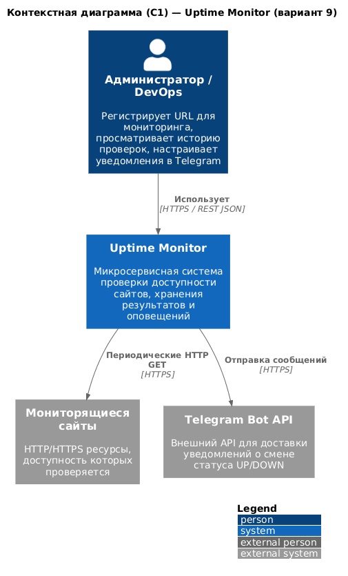
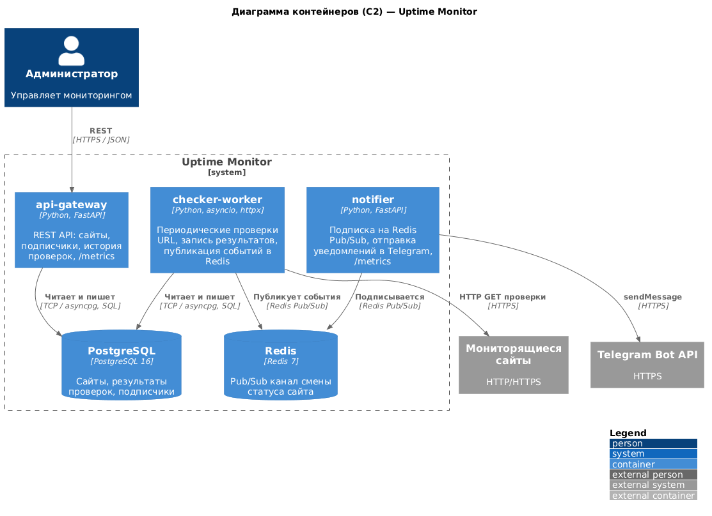
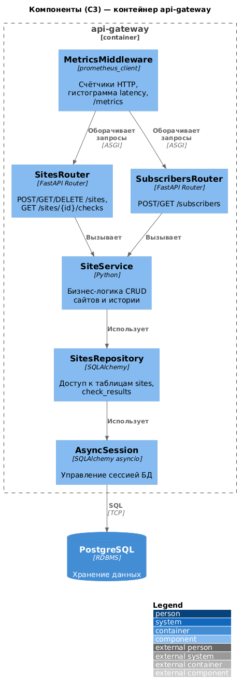

# Практика №1 — Архитектура Uptime Monitor (вариант 9)

## Выбранная тема

**Сервис проверки доступности сайтов (Uptime Monitor)** — система для регистрации URL, периодической проверки HTTP-доступности, хранения истории и оповещений в Telegram при смене статуса UP/DOWN.

## Problem Statement

Администраторы и инженеры эксплуатации нуждаются в простом способе отслеживать доступность критичных веб-ресурсов без ручных проверок. Система должна позволять добавлять URL с настраиваемым интервалом опроса, сохранять историю ответов (код, задержка, признак доступности) и автоматически уведомлять подписчиков в Telegram при изменении состояния сайта. Внешние системы: мониторящиеся сайты (цели HTTP-запросов) и Telegram Bot API для доставки сообщений.

## Диаграммы C4

Экспорт в PNG (не менее 1200×800): откройте соответствующий `.puml` на [plantuml.com/ru](https://www.plantuml.com/plantuml/uml/) или выполните локально `plantuml -tpng -Sdpi=150 *.puml` в каталоге `diagrams/`.

| Диаграмма | Исходник | Предпросмотр (PNG) |
|-----------|----------|-------------------|
| Контекст (C1) | [diagrams/context.puml](diagrams/context.puml) |  |
| Контейнеры (C2) | [diagrams/container.puml](diagrams/container.puml) |  |
| Компоненты api-gateway (C3) | [diagrams/component.puml](diagrams/component.puml) |  |

> Локальный рендер: `java -jar plantuml.jar -tpng -Sdpi=120 practice1/diagrams/*.puml` (JAR не коммитится, см. `.gitignore`).

## Критический анализ результатов генерации ИИ

| Аспект | Что сгенерировал ИИ | Что исправлено вручную | Обоснование исправления |
|--------|---------------------|------------------------|-------------------------|
| Границы системы | Лишние внешние системы (SMTP, Prometheus) | Оставлены только сайты и Telegram как внешние для MVP | Соответствие варианту 9 и минимальному scope |
| Связи контекста | Admin напрямую к Telegram | Связь только Admin → Uptime Monitor | Пользователь не вызывает Telegram API напрямую |
| Технологии контейнеров | «Node.js» для воркера | Python + httpx + asyncio для checker-worker | Выбранный стек по заданию (Python + FastAPI экосистема) |
| Redis | Описан как «очередь задач» | Уточнён как Pub/Sub для событий смены статуса | Фактическая модель взаимодействия checker → notifier |
| Компоненты C3 | Один монолитный «Controller» | Разделение Router / Service / Repository / Session | Читаемость и соответствие слоям FastAPI + SQLAlchemy |
| Легенда | Отсутствовала | `LAYOUT_WITH_LEGEND()` в каждом файле | Требования практики №1 к читаемости диаграмм |

## Вывод о пригодности ИИ для архитектурного проектирования

ИИ ускоряет черновой каркас диаграмм и подбор нотации C4-PlantUML, но часто добавляет «типовые» элементы (очереди, почту, лишние БД), не совпадающие с выбранной темой. Итоговая диаграмма должна проверяться человеком на соответствие границам системы, протоколам и реальному стеку перед сдачей.
