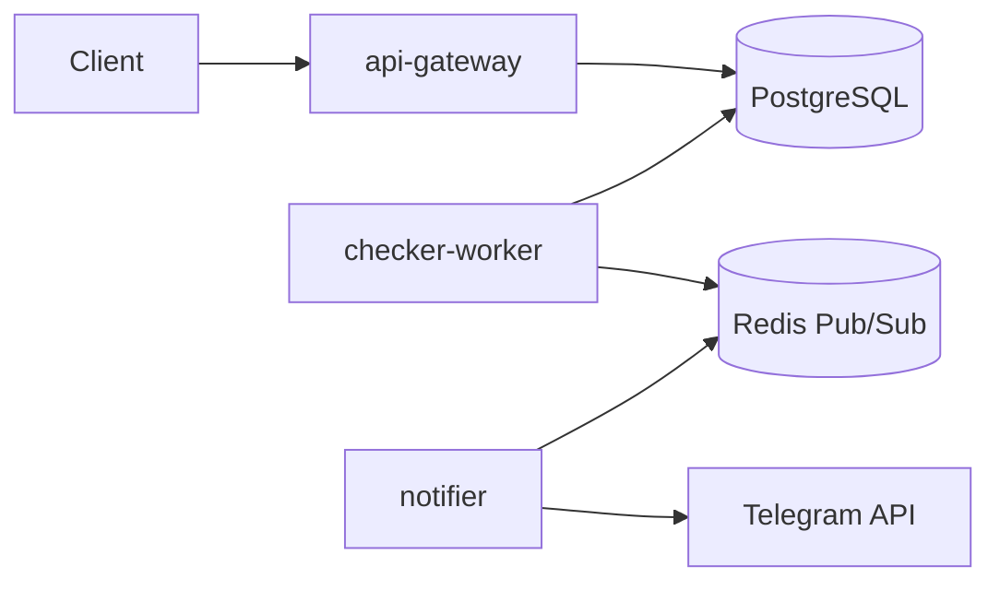

# Практика №2 — MVP Uptime Monitor

## Ссылка на репозиторий

URL публичного репозитория GitHub: `https://github.com/IPeaceDeathI/uptime-monitor`

## Использованные ИИ-инструменты

- **Cursor Agent** — генерация каркаса FastAPI, SQLAlchemy-моделей, Dockerfile, docker-compose, Kubernetes-манифестов и тестов.
- (Опционально) **GigaChat / YandexGPT** — уточнение формулировок Problem Statement и промптов для C4.

## Примеры промптов, давших наиболее полезный результат

1. «Создай FastAPI-сервис с async SQLAlchemy 2.0: модели Site, CheckResult, Subscriber, эндпоинты POST/GET /sites, GET /sites/{id}/checks, middleware для Prometheus http_requests_total и histogram latency.»
2. «Напиши asyncio-воркер: каждые 10 с читает сайты из PostgreSQL, httpx GET, пишет CheckResult, при смене is_up публикует JSON в Redis Pub/Sub.»
3. «Сгенерируй pytest-asyncio тесты: ASGITransport для API, MockTransport httpx для checker, unittest.mock для Telegram sendMessage.»

## Оценка доли кода ИИ / вручную

- **~65–75%** сгенерировано ИИ (структура сервисов, boilerplate, YAML, тестовые шаблоны).
- **~25–35%** доработано вручную (согласование схемы БД между сервисами, порядок `last_run` в воркере, обработка `IntegrityError`, метки Prometheus, тексты отчётов).

## Ошибки и «галлюцинации» ИИ

| Проблема | Как исправлено |
|----------|----------------|
| ИИ предложил `on_event("startup")` (устаревший паттерн FastAPI) | Заменено на `lifespan` |
| Неверная строка подключения `postgres://` для asyncpg | Исправлено на `postgresql+asyncpg://` |
| Лишняя связь «API → Telegram напрямую» на диаграмме | Убрана на этапе C4 (практика 1) |
| Предложено хранить очередь задач в Redis List вместо Pub/Sub | Выбран Pub/Sub под события смены статуса |

## Скриншоты (вставьте в отчёт при сдаче)

1. Успешный прогон тестов: `cd practice2 && pip install -r services/api-gateway/requirements.txt -r tests/requirements.txt && pytest -v`
2. Логи `docker compose up --build` с здоровыми сервисами `api-gateway`, `checker-worker`, `notifier`.

> Файлы скриншотов можно положить в `practice2/screenshots/` (создайте каталог при необходимости).

## Схема взаимодействия микросервисов



## Запуск локально

```bash
cd practice2
docker compose up --build
```

- API: http://localhost:8000/docs  
- Checker metrics: http://localhost:8001/metrics  
- Notifier metrics: http://localhost:8002/metrics  

Переменная `TELEGRAM_BOT_TOKEN` задаётся в `practice2/.env` рядом с `docker-compose.yml` (или через окружение хоста). В сервисе `notifier` токен обязателен и не имеет значения по умолчанию.
